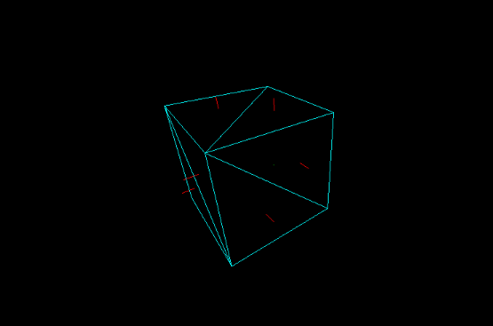

# 3D Renderer in C

A minimal, 3D graphics renderer built from scratch and written in C. No OpenGL, no high-level libraries, just math and pixels.



The main goal of this project was to learn about 3D graphics and the rendering pipeline. This also ties in with helping me learn more about C and safe-memory management. Big thank you to [ScratchPixel](www.scratchpixel.com) and [Learn OpenGL](https://learnopengl.com/) for breaking down graphics concepts!


---

## 🎨 Features

- Custom implemented 3D rendering pipeline: Model -> World -> View -> Projection
- 4x4 Homogeneous Matrix and Vectors with custom math implementation
- Custom `.obj` file loader (vertex, triangles, normals)
- Fly-style camera with perspective projection
- Bresenham's Line Algorithm for line rasterization and triangle creation
- Backface culling using winding order
- SDL3 for window and input handling

---

## 🛠️ Build Instructions

### ⚠️ Prequisites

- GCC or Clang
- CMake 3.16+
- SDL3 

### 👟 Steps
1. Clone this repo

```bash
git clone https://github.com/Zoly24/3d-renderer.git
cd 3d-renderer
```

2. Download SDL3 for your system

Arch Install:
```bash
sudo pacman -S sdl3
```

If your package manager does not include SDL3, build it from source [here](https://github.com/libsdl-org/SDL/blob/main/INSTALL.md)
3. Build the renderer

```bash
mkdir build
cd build
cmake ..
cd ..
```

4. Build and run
```bash
cmake --build build
./build/bin/renderer


```

## 🎮 Controls
- **WASD** - Move camera
- **Mouse** - Look around
- **ESC** - Quit

## 🧠 Function

The renderer follows conventional 3D rendering pipeline: 

|      Pipeline      |                             Function                              |
| ------------------ | ----------------------------------------------------------------- |
| .obj file          |            Collect vertex, surface normals, and vertex attributes |
| Model Matrix       |                                  Transform model into world space |
| View Matrix        |                Transform world space into the view space (camera) |
| Projection Matrix  |  Transform the view into (orthographic or perspective) projection |
| Viewport Transform |                                Transform 3d points into 2d points |
| Rasterize Lines    |                                  Generate lines and for triangles |

No external libraries to calculate matrix, vector, or transformation math. Everything was implemented in C.

## 📚 What I Learned
- 3D graphics pipeline implementation
- Matrix and vector mathematics
- Memory management in C
- SDL3 integration for windowing/input

## 🚀 Future Goals

See [todo.txt](todo.txt) for future plans

## 📄 License
MIT — feel free to learn from or extend this project.
